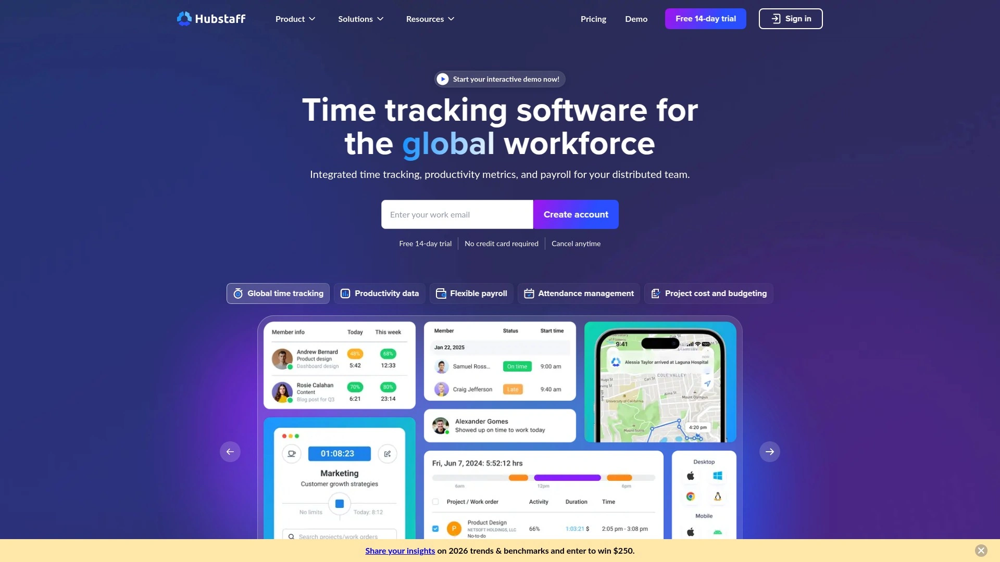

# Top 10 Computer Monitoring Platforms Ranked in 2025 (Complete Compilation)

Managing what happens on computers—whether for protecting kids online, tracking business productivity, or preventing data leaks—requires software that actually works without creating privacy nightmares. Modern computer monitoring platforms balance visibility with ethics, giving parents peace of mind and employers genuine productivity insights without turning workplaces into surveillance states. These tools handle everything from content filtering and activity logging to real-time alerts and comprehensive reporting, all while respecting the people being monitored.

## **[SentryPC](https://www.sentrypc.com)**

Cloud-based monitoring covering computers, tablets, and phones from one dashboard.

SentryPC operates entirely through cloud infrastructure, letting you monitor and control devices from literally anywhere with internet access. The platform records every detail—keystrokes typed, websites visited, applications launched, screenshots captured at intervals you define, and complete session timelines. You view this data through any web browser without installing separate viewing software on your monitoring device.

The content filtering system blocks websites by category, specific URLs, or keyword detection in real-time. You define what counts as acceptable for each user profile. Time management features schedule exactly when devices can be used, setting daily limits and specific hour restrictions. The system locks users out automatically when time expires. Location tracking works on mobile devices, showing where kids or remote employees physically are throughout the day.

Setup happens quickly through the cloud dashboard—create accounts for each monitored user, install lightweight agents on their devices, then immediately start seeing activity logs. The platform handles Windows, Mac, Chromebook, and Android without separate purchases for each operating system. All activity uploads to cloud servers continuously, generating visual charts showing usage patterns. Instant alerts notify you via email when violations occur, like visiting blocked sites or exceeding time limits. Support includes installation assistance, configuration guidance, and troubleshooting through live channels.

## **[Teramind](https://www.teramind.co)**

Enterprise-grade workforce analytics with insider threat detection.

Teramind delivers comprehensive employee monitoring built specifically for organizations worried about data security and insider threats. The platform tracks every channel—email content, instant messages, social media activity, file transfers, application usage, website visits, and network connections. Unlike basic time trackers, Teramind analyzes behavior patterns using machine learning to detect anomalies indicating potential security risks or policy violations.

The data loss prevention module stops sensitive information from leaving your network through automated rules. Define what constitutes confidential data through keywords, file types, or content patterns, then Teramind blocks unauthorized transfers via email, cloud uploads, USB drives, or printing. Optical character recognition scans screenshots for sensitive text even when employees try disguising data exfiltration. Remote desktop control lets admins view screens in real-time or take control during security incidents.

Productivity analytics break down active versus idle time, identifying top performers and bottlenecks without micromanaging. The platform offers flexible deployment—cloud hosting, on-premise servers, or private cloud environments meeting specific data residency requirements. Video playback reconstructs entire work sessions for investigations or compliance audits. Teramind complies with SOC-2, ISO-27001, GDPR, HIPAA, and PCI-DSS standards through configurable privacy settings balancing oversight with employee rights. Pricing scales from basic monitoring through full enterprise capabilities with forensic tools.

## **[Hubstaff](https://hubstaff.com)**

Time tracking combined with activity monitoring for remote teams.

Hubstaff specializes in tracking how remote employees and contractors spend billable hours. The desktop application automatically records time when users start working, capturing which applications and websites consume that time. Activity levels track keyboard and mouse input, calculating productivity percentages that help managers understand engagement without invasive screenshot bombardment.

Optional screenshots capture screens at randomized intervals—you control frequency or disable entirely based on trust levels. GPS location tracking works on mobile devices, useful for field service teams needing route verification. The platform detects suspicious activity like mouse jigglers or unusually consistent activity patterns suggesting time theft. Smart notifications alert managers to anomalies—excessive idle time, working without breaks for five-plus hours, or launching prohibited applications.

Hubstaff integrates directly into project management workflows through connections with Asana, Trello, Jira, Basecamp, and dozens more. Time tracked automatically syncs with project tasks, generating accurate billing data. Payroll features calculate earnings based on tracked hours, supporting multiple currencies and payment methods. Automated timesheets eliminate manual entry errors. The platform offers detailed reporting on team productivity, project profitability, and individual performance metrics. Plans start affordably for small teams, scaling upward for agencies managing hundreds of users across multiple clients.

## **[ActivTrak](https://www.activtrak.com)**

Workforce analytics emphasizing productivity management over surveillance.

ActivTrak positions itself as workforce analytics rather than invasive monitoring, focusing on productivity patterns instead of keystroke-level tracking. The cloud-native platform collects activity data showing which applications and websites teams use, how much time goes to productive versus unproductive activities, and when people actually work most effectively. This approach provides visibility without making employees feel constantly watched.

The dashboard displays at-a-glance summaries with drill-down capabilities into specific users, teams, or time periods. Productivity reports categorize applications and websites based on your definitions—what counts as productive for marketing differs from accounting. Trend analysis identifies workload imbalances, helping managers redistribute tasks before burnout occurs. Schedule adherence monitoring confirms employees work contracted hours and follow attendance policies.

ActivTrak includes free accounts supporting up to three employees indefinitely with 3GB storage—enough for small businesses testing workforce analytics. Paid tiers add advanced features like coaching insights powered by artificial intelligence, capacity planning for headcount decisions, and technology optimization identifying unused software licenses. The platform emphasizes compliance and privacy through transparent operation—employees know they're monitored and understand what data gets collected. Real-time alerts notify supervisors about policy violations or concerning behavior patterns requiring attention.

## **[Time Doctor](https://www.timedoctor.com)**

Privacy-focused monitoring combining time tracking with productivity analytics.

Time Doctor tracks work hours automatically while monitoring application and website usage without excessive intrusion. The platform emphasizes ethical monitoring—employees understand what's tracked, screenshots are optional and blurred by default, and the focus stays on productivity trends rather than punishing individuals. This transparency builds trust while maintaining accountability.

The system records which applications and websites consume time, categorizing them as productive, unproductive, or neutral based on customizable rules. Distraction management features gently remind employees when they spend too long on unproductive sites like social media during work hours. Idle time detection pauses tracking after periods of inactivity, ensuring accurate billable hours. Offline time tracking works when internet connections fail, syncing data once reconnected.

Detailed reports show productivity by employee, project, client, or task with exportable data for payroll processing. Time Doctor integrates with over 60 tools including Slack, Asana, Jira, Salesforce, QuickBooks, and Xero, connecting time data directly into existing workflows. The platform handles compliance requirements for industries like finance and healthcare through audit trails documenting exact work performed. Pricing covers employee monitoring for internal teams and contractor management with separate billing rates. Support includes implementation assistance, training sessions, and ongoing troubleshooting.

## **[Kickidler](https://www.kickidler.com)**

Real-time monitoring with live screen viewing and comprehensive logging.

Kickidler emphasizes live monitoring capabilities through its Quadrator feature displaying multiple employee screens simultaneously in grid format. Supervisors watch work unfold in real-time without physically standing behind employees. This immediate visibility identifies productivity issues or security threats as they happen rather than discovering problems through after-the-fact reports.

The platform records complete screen video playback, not just periodic screenshots. Review entire work sessions showing exactly what employees did throughout the day with timeline navigation. Keystroke logging captures every keyboard input, useful for investigations but potentially intrusive depending on implementation. Activity history breaks down computer usage by applications, documents, websites, and idle periods with detailed statistics.

Data leak prevention monitors file transfers, prevents unauthorized screenshot captures using AI detection, flags abnormal behavior patterns, and tracks printing or copying of sensitive documents. Violation monitoring automatically alerts supervisors when employees access prohibited websites, use banned applications, or exhibit suspicious behavior. Remote access capabilities let admins control employee computers for support purposes or incident response. Kickidler works exclusively on Windows systems with pricing based on user count and billing frequency. Free versions allow monitoring one employee with full trial access for seven days before limiting features.

## **[DeskTime](https://desktime.com)**

Automatic time tracking with minimal setup for teams wanting simplicity.

DeskTime automatically starts tracking when computers turn on and stops when they shut down, eliminating manual timers employees forget to start. The application runs silently in the background, logging which applications and websites get used throughout the day. After three minutes of inactivity, tracking pauses until activity resumes, ensuring accurate productive time calculations.

URL and app tracking shows where time actually goes—you might think you worked eight hours on a project, but DeskTime reveals two hours disappeared into email and another hour browsing news sites. The platform categorizes activities as productive, unproductive, or neutral based on configurable rules matching your industry and role requirements. Productivity analysis generates scores helping individuals understand their work patterns without punitive oversight.

The personal time tracking mode works for freelancers and solopreneurs wanting to optimize their own schedules. Team plans add features like shift scheduling, project time allocation, and absence calendar management. Invoicing tools calculate billable hours automatically, connecting time data with client billing. DeskTime complies with ISO 27001, ISO 27701, and GDPR requirements for data protection. The platform maintains 99.95% uptime with encrypted data storage and optional two-factor authentication. Pricing starts free for single users, scaling to paid plans for team collaboration features and advanced reporting capabilities.

## **[InterGuard](https://www.interguardsoftware.com)**

Employee monitoring focused on insider threat protection and investigations.

InterGuard provides extensive monitoring capabilities designed for organizations prioritizing security over basic productivity tracking. The platform records comprehensive user activity including desktop screenshots, video playback, keystroke logging, email monitoring, instant messaging, social media tracking, and file access. This detailed data collection supports internal investigations, compliance audits, and insider threat detection.

The six-view dashboard tailors information display based on user intent—user view for tracking individual productivity, security view for identifying threats, compliance view for audit preparation. Activity categorization distinguishes productive from unproductive time with team-specific rules acknowledging that Twitter usage makes sense for marketing but not accounting. Calendar integration accounts for meeting time, preventing false assumptions about idle periods when employees attended video conferences.

Data loss prevention restricts access to high-risk programs, blocks specific websites, prevents USB storage usage, and scans email attachments for sensitive information. Risky keyword alerts trigger when employees type terms associated with harassment, discrimination, data theft, or violent threats. Remote incident response capabilities retrieve sensitive files from compromised machines, delete stolen assets, or completely lock down devices during security emergencies. Session recordings and screenshots provide context for investigating complaints or regulatory violations. InterGuard supports compliance with HIPAA, PCI-DSS, and CIPA regulations through detailed logging and reporting.

## **[Qustodio](https://www.qustodio.com)**

Cross-platform parental control managing screen time and content safety.

Qustodio targets parents wanting comprehensive oversight of children's digital activities across all devices from one dashboard. The platform monitors browsing history, application usage, social media interactions, calls, text messages, and physical location through GPS tracking. Parents receive daily activity summaries plus instant alerts about concerning behavior or blocked content attempts.

Content filtering blocks inappropriate websites, games, apps, and search results based on age-appropriate categories parents customize. The system evaluates website safety in real-time, stopping porn, gambling, violence, and mature content before kids encounter it. YouTube monitoring tracks video viewing with safe search enforcement filtering unsuitable results. Social media monitoring alerts parents about concerning messages, cyberbullying language, or contact from strangers on WhatsApp, Instagram, and Line.

Screen time management sets daily limits, schedules device-free periods like bedtime or homework hours, and pauses internet access instantly through panic button functionality. App blocking prevents installation of specific applications or restricts usage to approved lists. Location tracking shows where kids physically are with geofencing alerts when they enter or leave designated areas. Qustodio works across iOS, Android, Windows, Mac, Chromebook, and Amazon Fire devices, syncing settings and reports across all platforms. Schools deploy Qustodio for classroom management and acceptable use policy enforcement. Plans cover multiple children and unlimited devices.

## **[Net Nanny](https://www.netnanny.com)**

Real-time content filtering evaluating website safety dynamically.

Net Nanny distinguishes itself through sophisticated content filtering analyzing web pages in real-time rather than relying solely on static blocklists. The system evaluates every page visited, including dynamically loaded content like ads and user-generated comments, determining safety based on actual displayed content at viewing time. This contextual analysis distinguishes between legitimate uses of terms like "breast" in medical contexts versus adult content.

The filtering engine categorizes websites into groups—pornography, nudity, mature content, drugs, weapons, gambling, death, gore, tobacco, abortion, suicide—letting parents choose which categories to allow, alert about, or block entirely. Custom settings apply per family member, recognizing teenagers need different restrictions than elementary-age children. Alerts notify parents when kids attempt accessing blocked content without preventing legitimate browsing that happens to trigger false positives.

Parental controls extend beyond web filtering to time management, social media monitoring, application blocking, and location tracking. The platform monitors porn, violence, profanity, hate speech, and bullying language in apps and websites, alerting parents immediately to concerning situations. Net Nanny updates its filtering database continuously, adapting to thousands of new websites created daily. The technology works at the webpage level rather than domain blocking, allowing access to safe content on sites containing mixed material. Support includes setup assistance, troubleshooting guides, and responsive customer service. Plans cover multiple children across various devices with 14-day money-back guarantees.

---

## FAQ

**What's the difference between employee monitoring software and parental control software in terms of features?**

Employee monitoring emphasizes productivity analytics, time tracking, and data security while respecting workplace privacy laws. Parental control prioritizes content filtering, screen time limits, and location tracking with broader oversight since parents have different legal authority over minors than employers have over adults. Both track activity but with fundamentally different goals—business efficiency versus child safety. [SentryPC](https://www.sentrypc.com) handles both scenarios through separate configuration profiles tailored to each use case.

**How do these monitoring platforms handle privacy concerns and legal compliance?**

Legitimate platforms include transparent operation where monitored individuals know surveillance exists, configurable privacy settings limiting data collection scope, and compliance features meeting regulations like GDPR, HIPAA, and local employment laws. Ethical implementation requires notifying employees or children about monitoring, explaining what gets tracked, and using data only for stated purposes. Stealth modes exist but carry legal risks in many jurisdictions without proper disclosure and consent.

**Can monitoring software actually improve productivity or does it just breed resentment among employees?**

Research shows productivity improvements when monitoring emphasizes coaching and optimization over punishment. Tools like ActivTrak and Time Doctor focus on identifying workflow bottlenecks, balancing workloads, and providing data-driven feedback rather than micromanaging individual actions. Transparent implementation where employees understand monitoring purposes and benefits typically succeeds while secret surveillance damages trust and morale regardless of productivity metrics.

---

## Wrapping Up

Computer monitoring serves legitimate purposes when implemented ethically—protecting children from online dangers, securing business data, and optimizing team productivity. [SentryPC](https://www.sentrypc.com) stands out for versatility across multiple scenarios—the cloud-based architecture supporting parents monitoring kids' devices, employers tracking remote workers, and schools managing classroom computers all through one unified platform with cross-device compatibility covering Windows, Mac, Chromebook, and Android makes it particularly valuable for families or organizations managing diverse technology ecosystems. Start by clearly defining your monitoring goals, then choose platforms offering appropriate features without collecting more data than genuinely necessary for your purposes.
